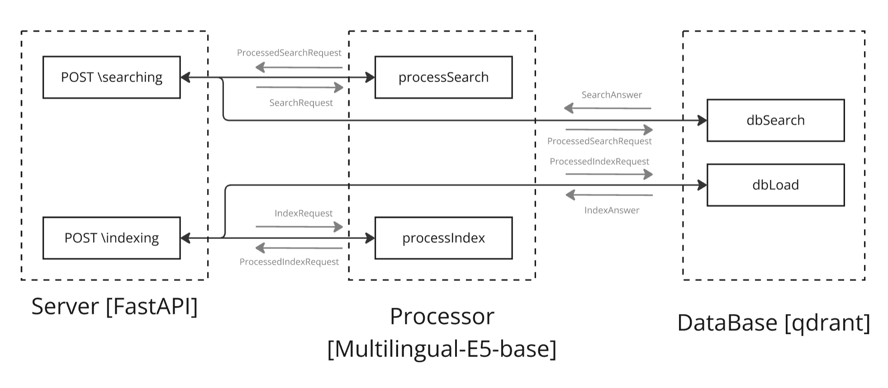

# Pargraph Search

Service for searching paragraphs.


## Dependences

This solution uses:
+ qdrant
+ docker
+ multilingual-e5
+ FastAPI


## Solution scheme



## API
Server run on *'localhost:5000'*.

*POST /searching*

```json
JSON {
    "text"      : "text",
    "top_k"     : 3,
    "filter_by" : "filter_by",
    "keywords"  : [
        "keyword"
    ]
}
```
```python
class SearchRequest(BaseModel):
    text      : str
    top_k     : int = 3
    filter_by : str | None = None
    keywords  : List[str] = []
```

*POST /indexing*
```json
JSON {
    "content": "content",
    "queries": [
        "queries"
    ],
    "keywords_or_phrases": [
        {
            "keyword_or_phrase": "keyword_or_phrase",
            "explanation": "explanation"
        },
        {
            "keyword_or_phrase": null,
            "explanation": null
        }
    ],
    "chunk_id": "chunk_id"
}
```
```python
class IndexRequest(BaseModel):
    content   : str
    queries   : List[str] | None = []
    keywords_or_phrases  : List[Dict[str, str | None]]  = []
    chunk_id  : str | None = None
```

## Installation

Pull docker image <https://hub.docker.com/r/largenumberofones/paragraph_search>
```bash
docker pull largenumberofones/paragraph_search
```
and then run docker compose with this docker-compose.yaml.
```yaml
services:
 server:
  image: largenumberofones/paragraph_search
   ports:
    - '5000:8000'
   qdrant:
	 image: qdrant/qdrant
     ports:
      - '6333:6333'
```


## Run

```bash
docker compose up
```
